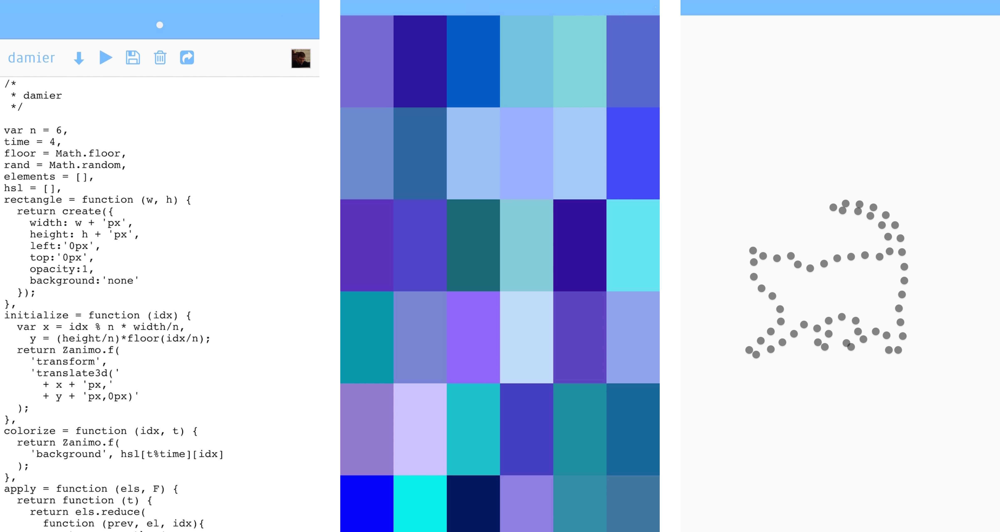

# the Zanimo.js editor



See http://zanimo.us for the web app.

* [Download ios app](https://itunes.apple.com/us/app/zanimo.js-editor/id817151357?mt=8)
* [Download android app](https://play.google.com/store/apps/details?id=com.fortytwoloops.zanimo)
* [Download windows phone](http://www.windowsphone.com/en-us/store/app/zanimo-js/8e695743-d7b9-4b5e-a70f-b57c5c9535d1)

# Build

Install [tarifa](http://tarifa.tools)

Regenerate cordova app and install defined plugins

```
tarifa check --verbose
```

Run editor on your device (ios, android, wp8 or browser)

```
tarifa run ios -V
```

## License

MIT
